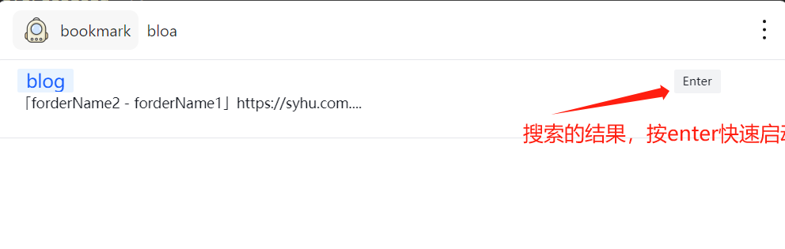

# Bookmark-Sharp

### 主要的格式：
```json
{
   "roots": {
      "bookmark_bar": {
         "children": [
            {
               "name": "blog2",
               "type": "url",
               "url": "https://syhu.com.cn"
            },
            {
               "children": [
                  {
                     "children": [
                        {
                           "name": "blog",
                           "type": "url",
                           "url": "https://syhu.com.cn"
                        }
                     ],
                     "date_modified": "0",
                     "name": "forderName1",
                     "type": "folder"
                  }
               ],
               "date_modified": "0",
               "name": "forderName2",
               "type": "folder"
            }
         ],
         "date_modified": "0",
         "name": "书签栏",
         "type": "folder"
      }
   },
   "version": 1
}
```


### 使用方法
#### 先输入`setting`进入配置页面上传上述格式的书签文件
#### 然后输入`bookmark`就可以进行搜索啦 
